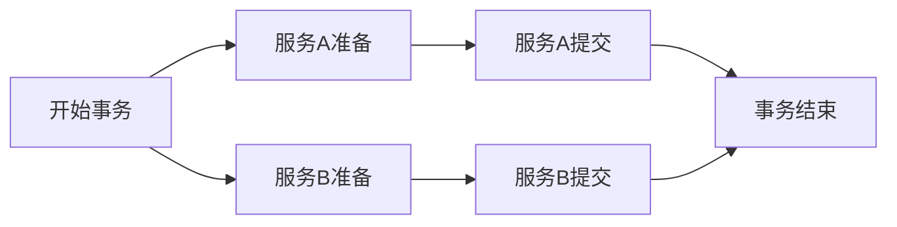

 


简介：Spring Statemachine框架通过提供状态机抽象，简化了在Spring环境中实现和管理复杂工作流程及业务逻辑的过程。本文深入探讨了Spring Statemachine的核心概念、功能及应用，包括状态和转换的结构化定义、事件驱动的状态变迁、持久化支持以及集成Spring生态系统。通过实例分析，展示了其在多个领域的实际应用，并讨论了如何自定义扩展以满足特定需求。 

1\. 状态机概念和组件介绍
--------------

状态机（State Machine）是用于描述一个对象在其生命周期中响应事件而产生的状态变化的数学模型。它由一系列状态（States）、转换（Transitions）、事件（Events）、卫兵（Guards）和动作（Actions）组成。状态机常用于软件开发中，用于控制程序的流程和状态变化。

在Spring Statemachine框架中，状态机被抽象为几个核心组件，它们协同工作，为开发者提供了一种灵活的方式来处理复杂的状态变化。核心组件包括：

*   **状态机（StateMachine）** ：这是状态机的核心，负责维护状态机的当前状态，并响应事件来触发状态转换。
*   **配置器（Configurator）** ：用于配置状态机的不同部分，包括状态、事件和转换。
*   **上下文（Context）** ：为状态机提供运行时上下文信息，使得状态转换可以根据上下文做出决策。
*   **监听器（Listener）** ：允许开发者监听状态机的生命周期事件，如状态切换、转换触发等。

通过理解这些组件，开发者可以更容易地构建出高效和易于维护的基于事件驱动的应用程序。

```java
// 一个简单的状态机配置示例
StateMachine<String, String> stateMachine = new DefaultStateMachineBuilder<String, String>()
    .state("initial")
    .state("middle")
    .state("end")
    .transition().from("initial").to("middle").on("MIDDLE_EVENT")
    .transition().from("middle").to("end").on("END_EVENT")
    .build();
 
stateMachine.start();
stateMachine.sendEvent("MIDDLE_EVENT");
stateMachine.sendEvent("END_EVENT");
```

以上代码创建了一个由三个状态组成的简单状态机，并通过事件触发状态转换。实际应用中，状态机通常会更加复杂，并且需要细致地配置以满足特定业务需求。

2\. 状态机的要素详析
------------

在探索状态机的奥秘时，理解其核心要素至关重要。状态机由状态、转换、事件、卫兵和动作组成，每个要素都扮演着特定的角色并共同确保系统的状态按预期流转。在本章中，我们将逐一深入这些要素，并通过实例展示它们是如何协同工作的。

### 2.1 状态机状态

#### 2.1.1 状态的定义及其重要性

状态机之所以能描述系统的行为，是因为它能够表达系统在不同时间点可能处于的不同状态。状态代表了系统的一种稳定情况，在整个软件系统中，状态的改变往往伴随着事件的发生。

在编程实践中，状态通常用枚举或类来表示，它们定义了系统可能存在的所有状态。理解并明确定义系统状态是设计良好状态机的关键。例如，一个订单处理系统可能有“待支付”、“支付完成”、“配送中”和“已完成”等状态。

#### 2.1.2 状态类型和状态机配置

状态可以分为基本状态和复合状态。基本状态是指不能再细分的状态，而复合状态则可以包含多个子状态。在设计时，需要根据系统的业务逻辑来定义状态的类型。

状态机配置通常涉及指定初始状态和定义所有可能的状态。配置状态时，还需要决定状态是否是终态（end state），即是否是状态机流程的结束点。

```java
// 示例代码：状态枚举定义
public enum OrderState {
    // 基本状态
    WAITING_FOR_PAYMENT,
    PAID,
    SHIPPED,
    COMPLETED,
    // 复合状态
    // ...
}
```

### 2.2 转换与事件

#### 2.2.1 转换的基本原理和应用

转换是指状态机从一个状态转移到另一个状态的过程，它是状态机流转的核心。转换可以由事件触发，也可以由某些条件或时间触发。事件是导致状态转换的驱动力，而转换规则定义了在特定事件发生时系统应如何响应。

在实现转换时，我们需要定义触发转换的事件，以及转换到的目标状态。转换规则可以是简单的也可以是复杂的，例如，它们可以包含前置条件（卫兵）或后置动作。

```java
// 示例代码：状态转换配置
@Configuration
@EnableStateMachine
public class OrderStateMachineConfig 
      extends StateMachineConfigurerAdapter<OrderState, OrderEvent> {
    @Override
    public void configure(StateMachineConfigurationConfigurer<OrderState, OrderEvent> config) throws Exception {
        config.withConfiguration()
              .autoStartup(true)
              .listener(new StateMachineListenerAdapter<>());
    }
    @Override
    public void configure(StateMachineStateConfigurer<OrderState, OrderEvent> states) throws Exception {
        states.withStates()
              .initial(OrderState.WAITING_FOR_PAYMENT)
              .end(***PLETED)
              .states(EnumSet.allOf(OrderState.class));
    }
    @Override
    public void configure(StateMachineTransitionConfigurer<OrderState, OrderEvent> transitions) throws Exception {
        transitions.withExternal()
                   .source(OrderState.WAITING_FOR_PAYMENT)
                   .target(OrderState.PAID)
                   .event(OrderEvent.PAYMENT_COMPLETED);
    }
}
```

#### 2.2.2 事件触发机制和事件监听

事件触发机制指的是当某个操作发生时，系统如何识别并响应该事件。在状态机中，事件通常是通过消息或信号传递的。事件监听器负责监听这些事件，并在特定事件发生时触发状态转换。

事件可以是同步的也可以是异步的，这取决于事件的传播方式。事件监听器可以是一个简单的回调函数，也可以是实现特定接口的复杂组件，用于处理事件并执行相应的状态转换逻辑。

```java
// 示例代码：状态转换触发
// 假设有一个方法用于处理支付事件
void processPayment(Order order);
 
// 在处理支付完成后，触发状态转换事件
processPayment(someOrder);
```

### 2.3 卫兵与动作

#### 2.3.1 卫兵的作用和使用场景

卫兵（Guard）是状态机中的一个决策点，它在转换发生之前进行条件检查。如果卫兵返回true，则允许状态转换继续进行；如果返回false，则阻止转换。卫兵的作用类似于编程中的if语句，它们允许我们根据当前的状态和上下文来控制转换。

在实际应用中，卫兵可以用来实现权限检查、条件验证或其他决策逻辑，确保状态转换符合业务规则。

```java
// 示例代码：卫兵实现
public class PaymentGuard implements Guardian<OrderState, OrderEvent> {
    @Override
    public boolean evaluate(StateContext<OrderState, OrderEvent> context) {
        Order order = (Order) context.getExtendedState().getVariables().get("order");
        return order.getAmountDue() == order.getAmountPaid();
    }
}
 
// 在状态转换配置中使用卫兵
transitions.withExternal()
           .source(OrderState.PAID)
           .target(OrderState.SHIPPED)
           .event(OrderEvent.SHIP_ORDER)
           .guard(new PaymentGuard());
```

#### 2.3.2 动作的实现和影响

动作（Action）是在状态转换发生时执行的代码块。与卫兵不同，动作是在转换确定发生后执行的，因此可以认为是状态转换的一部分。

动作可以是打印日志、更新系统状态、发送通知等。动作对于实现状态机的副作用至关重要，它们让状态转换具有实际的业务意义。

```java
// 示例代码：动作实现
public class ShippingAction implements Action<OrderState, OrderEvent> {
    @Override
    public void execute(StateContext<OrderState, OrderEvent> context) {
        Order order = (Order) context.getExtendedState().getVariables().get("order");
        // 执行发货逻辑
        shipmentService.shipOrder(order);
    }
}
 
// 在状态转换配置中使用动作
transitions.withExternal()
           .source(OrderState.PAID)
           .target(OrderState.SHIPPED)
           .event(OrderEvent.SHIP_ORDER)
           .action(new ShippingAction());
```

在本章中，我们深入了解了状态机的几个关键要素，并通过代码示例展示了它们在实践中的应用。通过这些章节的学习，您应该对如何构建和操作状态机有了更清晰的认识。接下来的章节将继续探讨Spring Statemachine的配置与使用方法，以及如何将其与Spring生态集成。

3\. Spring Statemachine的配置与使用方法
-------------------------------

在软件开发中，状态机的应用能够极大地简化复杂业务逻辑的处理，提升系统稳定性和可维护性。Spring Statemachine是一个强大的状态管理库，它为Spring框架中的应用程序提供了丰富的状态机管理功能。本章将详细解读如何配置和使用Spring Statemachine，确保开发者能够快速地将其融入到自己的项目之中。

### 3.1 配置Spring Statemachine

配置是使用Spring Statemachine的基础。通过合理的配置，状态机的各个组件得以有机组合，形成一个协同工作的整体。

#### 3.1.1 状态机配置文件的编写

一个典型的状态机配置文件包括状态定义、转换规则以及事件触发等。以下是一个简单的状态机配置文件示例：

```java
@Configuration
@EnableStateMachine
public class StateMachineConfig extends StateMachineConfigurerAdapter<String, String> {
 
    @Override
    public void configure(StateMachineConfigurationConfigurer<String, String> config)
            throws Exception {
        config
            .withConfiguration()
            .autoStartup(true)
            .defaultExitPointState("S2")
            .defaultEntrypointState("S1");
    }
 
    @Override
    public void configure(StateMachineStateConfigurer<String, String> states)
            throws Exception {
        states
            .withStates()
            .initial("S1")
            .state("S2")
            .end("SF");
    }
 
    @Override
    public void configure(StateMachineTransitionConfigurer<String, String> transitions)
            throws Exception {
        transitions
            .withExternal()
            .source("S1").target("S2")
            .event("E1");
    }
}
```

在这个配置中，我们定义了一个简单的状态机，它具有三个状态（S1, S2, SF），其中S1是初始状态，SF是结束状态。我们还定义了一个事件E1，当事件E1被触发时，状态机会从S1转换到S2。

#### 3.1.2 配置项详解和最佳实践

配置项详解：

*   `withConfiguration()` ：此方法用于配置状态机的全局行为，例如自动启动、默认入口点、默认退出点等。
*   `withStates()` ：此方法用于定义状态机的状态，可以设置初始状态、结束状态以及嵌套状态。
*   `withExternal()` ：此方法用于定义从一个状态到另一个状态的转换，包括触发事件和目标状态。

最佳实践：

*   **状态命名** ：状态名应该简洁明了，能够表达状态的意义。
*   **事件命名** ：事件名称应清晰地指示事件触发的动作。
*   **事件处理** ：避免在事件处理中执行复杂的逻辑，简单事件处理有助于保持代码的可读性和可维护性。

### 3.2 构建和运行状态机

状态机的构建和运行是状态机使用中非常关键的环节，开发者需要掌握如何实例化状态机，以及如何通过编程方式触发事件和转换状态。

#### 3.2.1 状态机工厂和状态机实例化

状态机工厂负责创建状态机实例，它是状态机创建的起点。在Spring环境中，可以利用Spring的依赖注入机制来获取状态机工厂：

```java
@Autowired
private StateMachineFactory<String, String> stateMachineFactory;
 
public StateMachine<String, String> getStateMachine() {
    return stateMachineFactory.getStateMachine("stateMachine1");
}
```

在上述代码中，我们通过 `StateMachineFactory` 获取了一个名为 `stateMachine1` 的状态机实例。

#### 3.2.2 触发事件和状态转换的编程方式

为了触发事件和转换状态，我们可以编写一个方法来执行这个操作：

```java
public void sendEvent(String event) {
    StateMachine<String, String> stateMachine = getStateMachine();
    stateMachine.sendEvent(MessageBuilder.withPayload(event)
                                          .setHeader(MessageHeaders.CONTENT_TYPE, MimeTypeUtils.TEXT_PLAIN).build());
}
```

在这个方法中，我们首先获取了状态机实例，然后创建了一个消息对象，并通过 `sendEvent` 方法发送事件。这样就可以根据事件来触发状态转换了。

#### 运行时控制

Spring Statemachine 提供了多种运行时控制的方式，包括同步和异步调用，以适应不同的业务场景需求。

```java
public class StateMachineRunner {
 
    private StateMachine<String, String> stateMachine;
 
    public StateMachineRunner(StateMachine<String, String> stateMachine) {
        this.stateMachine = stateMachine;
    }
 
    public void runStateMachine() {
        try {
            stateMachine.start();
            stateMachine.sendEvent("E1");
            // 等待一段时间或者某个条件满足后再继续
            Thread.sleep(1000);
            stateMachine.sendEvent("E2");
            stateMachine.stop();
        } catch (Exception e) {
            e.printStackTrace();
        }
    }
}
```

在这个 `StateMachineRunner` 类中，我们启动了状态机，发送了两个事件，并最终停止了状态机。这个过程是同步的，每个事件处理完毕后才会继续执行下一个操作。

以上所述内容涵盖了从配置文件的编写，到状态机实例化，再到状态转换的触发等主要方面，为读者提供了全面的配置与使用Spring Statemachine的方法指导。在此基础上，开发者可以在实际项目中灵活应用这些知识，提高状态管理的效率和系统的可靠性。

4\. 持久化支持的细节与实现
---------------

在复杂的业务场景中，状态机可能需要跨越多个业务会话或服务重启，保持状态机的当前状态变得至关重要。因此，Spring Statemachine提供了对持久化的支持，以确保状态机的稳定和可靠运行。在本章中，我们将深入探讨持久化的基础，以及如何在实际开发中实现高级的持久化应用。

### 4.1 持久化基础

#### 4.1.1 持久化概念及其目的

持久化是将状态机的数据存储到非易失性存储器中的过程，以便在系统重启后能够恢复到之前的运行状态。在状态机中，这通常涉及到存储当前状态和可能的未完成事件。通过持久化，可以确保业务流程在经历意外中断后能够继续执行，提升系统的健壮性和用户体验。

持久化在分布式系统中尤其重要，因为它可以帮助维护跨多个服务或节点的状态一致性。比如在订单处理系统中，如果订单状态被持久化，那么即使服务重启，用户也不会因为系统故障而丢失订单信息。

#### 4.1.2 持久化策略和配置方法

Spring Statemachine提供了多种持久化策略，这些策略包括但不限于数据库、消息队列和文件系统。在实际使用中，可以通过扩展 `Persister` 接口来自定义持久化策略，以满足特定的业务需求。

例如，可以使用Spring Data JPA来存储状态机的状态，具体方法如下：

```java
@Configuration
@EnableStateMachine
public class StateMachineConfig extends StateMachineConfigurerAdapter<String, String> {
 
    @Autowired
    private StateMachinePersister<String, String, Context> persister;
 
    @Override
    public void configure(StateMachinePersister<String, String, Context> persister) {
        this.persister = persister;
    }
 
    // 配置状态机状态等其他必要的配置
}
```

在上面的代码中， `StateMachinePersister` 被配置用于状态机的持久化，可以在系统重启时恢复状态。 `Context` 是与当前线程相关的上下文信息，它可以根据业务需求包含额外的数据。

### 4.2 持久化高级应用

#### 4.2.1 高可用状态机设计和故障恢复

为了构建高可用的状态机，必须考虑如何快速且正确地恢复状态机的状态。这涉及到合理的故障检测和切换机制，以及状态机状态的实时备份。

在Spring Statemachine中，可以结合使用心跳机制和双机热备策略来实现高可用性。心跳机制用于定期检查状态机实例的健康状态，而双机热备则保证了一旦主实例出现问题，备用实例可以立即接管业务流程。

#### 4.2.2 持久化数据的同步和一致性问题

在分布式系统中，持久化数据的同步是一个挑战，特别是在涉及到多个服务实例时。因此，必须实现数据的一致性策略，以确保所有服务实例看到的是相同的状态信息。

这通常可以通过分布式事务或最终一致性模型来解决。以分布式事务为例，可以使用两阶段提交协议来保证事务的原子性和一致性。



上图展示了一个典型的两阶段提交流程。在这个过程中，所有服务实例必须同时提交或回滚，以保证状态的一致性。

#### 总结

在本章中，我们了解了Spring Statemachine持久化机制的基础，探讨了持久化的策略和配置方法。然后，我们深入到持久化的高级应用，考虑了高可用状态机设计和故障恢复策略，以及持久化数据同步和一致性问题。

持久化是构建稳定业务流程不可或缺的一部分，特别是在复杂系统和分布式环境中。通过理解并正确应用Spring Statemachine的持久化特性，开发者可以构建出更健壮、可靠的应用程序。

5\. 监听器的注册与使用
-------------

### 5.1 监听器的作用和分类

状态机与应用程序的交互很多时候依赖于事件和状态的流动，而监听器正是这一交互过程中的关键组件。它们可以对状态机的行为进行监视，并在特定的时机做出响应。根据不同的功能需求，监听器可以分为状态监听器、事件监听器和动作监听器。

#### 5.1.1 状态监听器的定义和作用

状态监听器关注的是状态的变更。每当状态机进入一个新的状态时，状态监听器就会被触发。开发者可以利用这一点来执行与状态变化相关的业务逻辑，比如记录日志、更新UI界面或者执行一些清理工作。

```java
public class CustomStateListener implements StateListener {
    @Override
    public void stateChanged(State fromState, State toState) {
        // 从状态fromState变化到状态toState
        System.out.println("State change from " + fromState.getId() + " to " + toState.getId());
    }
}
```

在上面的代码示例中，我们创建了一个 `CustomStateListener` 类，覆盖了 `stateChanged` 方法，该方法会在状态变化时被调用。 `fromState` 和 `toState` 参数分别表示变化前后的状态。

#### 5.1.2 事件监听器与动作监听器的区别和应用

事件监听器主要监听事件的触发过程。在事件被接受处理之前，事件监听器有机会对事件进行预处理，甚至可以阻止事件的进一步处理。这在需要在事件处理之前进行一些校验的场景中非常有用。

动作监听器则是在事件被处理之后执行。在状态机的转换过程中，动作监听器可以执行一些自定义的动作，比如发送通知、调用外部API等。

```java
public class CustomActionListener implements ActionListener {
    @Override
    public void onAction(Action action, Transition transition) {
        if ("SEND_EMAIL".equals(action.getId())) {
            System.out.println("Sending email as an action is performed");
        }
    }
}
```

上述代码定义了一个 `CustomActionListener` 类，它实现了 `ActionListener` 接口。在事件处理的动作执行时， `onAction` 方法会被调用。这里，我们通过动作的ID来判断是否需要执行特定的操作。

### 5.2 监听器的高级使用技巧

监听器的高级使用技巧涉及到监听器的组合使用、自定义监听器实现等，以及在复杂场景下如何选择合适的监听器策略。

#### 5.2.1 复合监听器和自定义监听器

复合监听器是一个包含多个监听器的监听器。它允许我们把多个监听器的职责合并到一起，简化了监听器的管理。开发者也可以根据业务需求自定义监听器，以便于处理更复杂的场景。

```java
public class CompositeListener implements StateListener, ActionListener {
    @Override
    public void stateChanged(State fromState, State toState) {
        // 状态变化处理逻辑
    }
 
    @Override
    public void onAction(Action action, Transition transition) {
        // 动作执行处理逻辑
    }
}
```

在复合监听器 `CompositeListener` 中，我们同时实现了 `StateListener` 和 `ActionListener` 接口。这样，它既能够监听状态变化，也能够处理动作执行事件。

#### 5.2.2 监听器在复杂场景下的应用案例

当状态机需要与外部服务交互时，监听器就可以发挥作用。例如，在一个支付流程的状态机中，每当状态变化到“支付成功”时，可能需要通知外部系统进行库存的更新。在这样的场景下，可以通过自定义监听器来处理与外部系统的交互。

```java
public class InventoryUpdateListener implements StateListener {
    @Override
    public void stateChanged(State fromState, State toState) {
        if (toState.getId().equals("PAYMENT_SUCCESS")) {
            // 执行库存更新操作
            System.out.println("Updating inventory as payment succeeded");
        }
    }
}
```

在上述代码中， `InventoryUpdateListener` 监听状态变化。一旦状态变为“PAYMENT\_SUCCESS”，则执行库存更新逻辑。这显示了监听器在处理状态机和外部系统交互时的灵活性和能力。

在本章中，我们详细探讨了监听器在Spring Statemachine中的作用及其分类，并通过代码示例加深了对其应用的理解。下一章节将继续扩展Spring Statemachine的应用范围，介绍它与Spring生态的集成。

6\. Spring Statemachine与Spring生态的集成
-----------------------------------

### 6.1 Spring Boot集成实践

#### 6.1.1 Spring Boot项目中状态机的嵌入和配置

在Spring Boot项目中集成状态机，可以利用Spring Boot的自动配置和简化配置的能力，来快速地构建和部署状态机应用。Spring Boot为状态机提供了开箱即用的支持，我们可以很容易地将状态机嵌入到Spring Boot应用中。

```java
@SpringBootApplication
@EnableStateMachine
public class Application {
 
    public static void main(String[] args) {
        SpringApplication.run(Application.class, args);
    }
 
    @Bean
    public StateMachineConfigurationConfigurer<States, Events> configurer() {
        return config -> config
                .withConfiguration()
                .autoStartup(true)
                .listener(new MyStateMachineListener());
    }
    // 其他配置代码...
}
```

在上述代码中，通过 `@EnableStateMachine` 注解，我们启用了状态机功能。通过 `StateMachineConfigurationConfigurer` 我们可以设置状态机的行为，如是否自动启动。同时，我们可以注入自己的监听器，用于处理状态机事件。

#### 6.1.2 利用Spring Boot简化状态机配置和部署

Spring Boot的应用程序可以通过 `application.yml` 或 `application.properties` 文件进行配置，状态机的配置也可以被集成到这些配置文件中。通过配置文件，我们能以声明式的方式管理状态机配置，使状态机的配置更加灵活和易于管理。

```yaml
statemachine:
  states:
    - 'STATE1'
    - 'STATE2'
  events:
    - 'EVENT1'
    - 'EVENT2'
  transitions:
    - source: 'STATE1'
      target: 'STATE2'
      event: 'EVENT1'
  autoStartup: true
```

通过YAML配置文件，我们可以定义状态机的状态、事件和转换规则。当Spring Boot应用启动时，状态机的配置会自动加载并应用。这样，我们不需要在代码中硬编码所有的状态机配置，使应用程序的维护和部署变得更加容易。

### 6.2 其他Spring组件的集成

#### 6.2.1 与Spring Security的集成

在需要保护状态机安全的场景下，Spring Statemachine与Spring Security的集成显得尤为重要。状态机的某些状态转换可能需要权限控制，这时我们可以利用Spring Security提供的认证和授权机制。

```java
@Configuration
@EnableStateMachineSecurity
public class SecurityConfig extends StateMachineConfigurerAdapter<String, String> {
 
    @Override
    public void configure(StateMachineSecurityConfigurer<String, String> security) throws Exception {
        security
            .withSecurity()
            .runtimeAccess()
            .roles("ADMIN")
            .and()
            .authorize("hasRole('ADMIN')")
            .anyState()
            .anyEvent();
    }
 
    // 其他配置代码...
}
```

在 `SecurityConfig` 类中，我们通过重写 `configure` 方法来配置状态机的安全策略。在这个例子中，我们设置了只有角色为"ADMIN"的用户才能访问和触发任何状态机操作。这为状态机提供了一层安全保护，确保了状态机操作的安全性。

#### 6.2.2 与Spring Data JPA和其他数据访问技术的集成

状态机在运行过程中需要持久化状态信息，因此与Spring Data JPA的集成可以提供一个便捷的方式来存储和检索状态信息。Spring Data JPA能够简化数据访问层的开发，我们可以通过定义接口的方式来实现数据访问操作。

```java
@Entity
public class StateMachineEntity {
    @Id
    @GeneratedValue(strategy = GenerationType.AUTO)
    private Long id;
 
    // 其他字段和方法...
}
 
public interface StateMachineRepository extends JpaRepository<StateMachineEntity, Long> {
    // 自定义查询操作...
}
 
// 在状态机配置中引用StateMachineRepository...
```

我们定义了一个实体 `StateMachineEntity` 来映射状态信息到数据库中，并创建了一个继承自 `JpaRepository` 的接口 `StateMachineRepository` ，用于处理状态信息的CRUD操作。这样，状态机的状态就可以被持久化到数据库中，并且可以根据需要进行查询和更新。

通过上述实践，我们可以看到Spring Statemachine与Spring Boot、Spring Security以及Spring Data JPA等组件可以无缝集成。这使得在实际的项目开发中，状态机的应用更加灵活和强大，满足了不同场景下的需求。

7\. 核心特性及扩展性的讨论
---------------

在深入理解了Spring Statemachine的基本原理和应用之后，我们进入第七章，来探究这一框架的核心特性，以及如何在现有基础上进行扩展，以适应未来更加复杂的应用场景。

### 7.1 核心特性的探讨

#### 7.1.1 状态机的设计哲学和灵活性

Spring Statemachine的设计哲学在于将复杂的业务逻辑转化为清晰的状态转换图。这种模式为开发人员提供了极大的灵活性，允许他们通过配置而非编码来控制业务流程的状态转换，从而提高了软件的可维护性和扩展性。

#### 7.1.2 易用性和性能优势分析

作为Spring家族的一员，Spring Statemachine极大地简化了状态机的使用门槛，同时保留了强大的性能优势。易用性不仅体现在简单的API上，还包括了丰富的配置选项和监听器机制，让开发者可以轻松地监控和管理状态机的行为。

```java
// 示例代码：简单状态机配置
@Configuration
@EnableStateMachine
public class SimpleStateMachineConfig extends StateMachineConfigurerAdapter<String, String> {
    @Override
    public void configure(StateMachineConfigurationConfigurer<String, String> config) throws Exception {
        config.withConfiguration()
              .autoStartup(true)
              .defaultTransactionMode(DefaultTransactionMode.SUPPORT);
    }
 
    @Override
    public void configure(StateMachineStateConfigurer<String, String> states) throws Exception {
        states.withStates()
              .initial("SI")
              .end("SF")
              .states(EnumSet.allOf(MyState.class));
    }
 
    @Override
    public void configure(StateMachineTransitionConfigurer<String, String> transitions) throws Exception {
        transitions.withExternal()
                   .source("SI").target("S1")
                   .event("E1")
                   .and()
                   .withExternal()
                   .source("S1").target("SF")
                   .event("E2");
    }
}
```

在性能方面，Spring Statemachine利用了高效的事件处理机制和状态管理，为状态转换提供了低延迟和高吞吐量的处理能力。这使得它在需要高频状态转换的场景下表现尤为突出。

### 7.2 扩展性与未来展望

#### 7.2.1 如何扩展Spring Statemachine功能

Spring Statemachine本身提供了一套丰富的扩展点，允许开发者以非侵入式的方式来增加新的功能。例如，可以通过实现 `StateConfigurer` 、 `TransitionConfigurer` 等接口来自定义状态机的行为。此外，使用监听器机制可以监听状态变化，并根据需要执行特定逻辑。

#### 7.2.2 开源社区贡献和未来趋势预测

开源社区是Spring Statemachine发展的重要推动力。许多增强和新特性都是由社区贡献而来。未来，可以预见的扩展方向包括增强持久化能力，以支持更大规模和更复杂的业务场景，以及提高状态机的可视化和易用性，从而让非技术用户也能理解和操作状态机。

通过以上章节的讨论，我们可以看到Spring Statemachine不仅能够处理复杂的业务逻辑，而且提供了强大的可扩展性以应对不断变化的技术挑战。对于IT行业和相关行业的专业人士来说，深入理解并掌握这一框架，将为解决实际问题提供新的视角和工具。


简介：Spring Statemachine框架通过提供状态机抽象，简化了在Spring环境中实现和管理复杂工作流程及业务逻辑的过程。本文深入探讨了Spring Statemachine的核心概念、功能及应用，包括状态和转换的结构化定义、事件驱动的状态变迁、持久化支持以及集成Spring生态系统。通过实例分析，展示了其在多个领域的实际应用，并讨论了如何自定义扩展以满足特定需求。


本文转自 <https://blog.csdn.net/weixin_36047538/article/details/142722156>，如有侵权，请联系删除。
